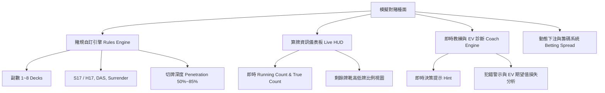
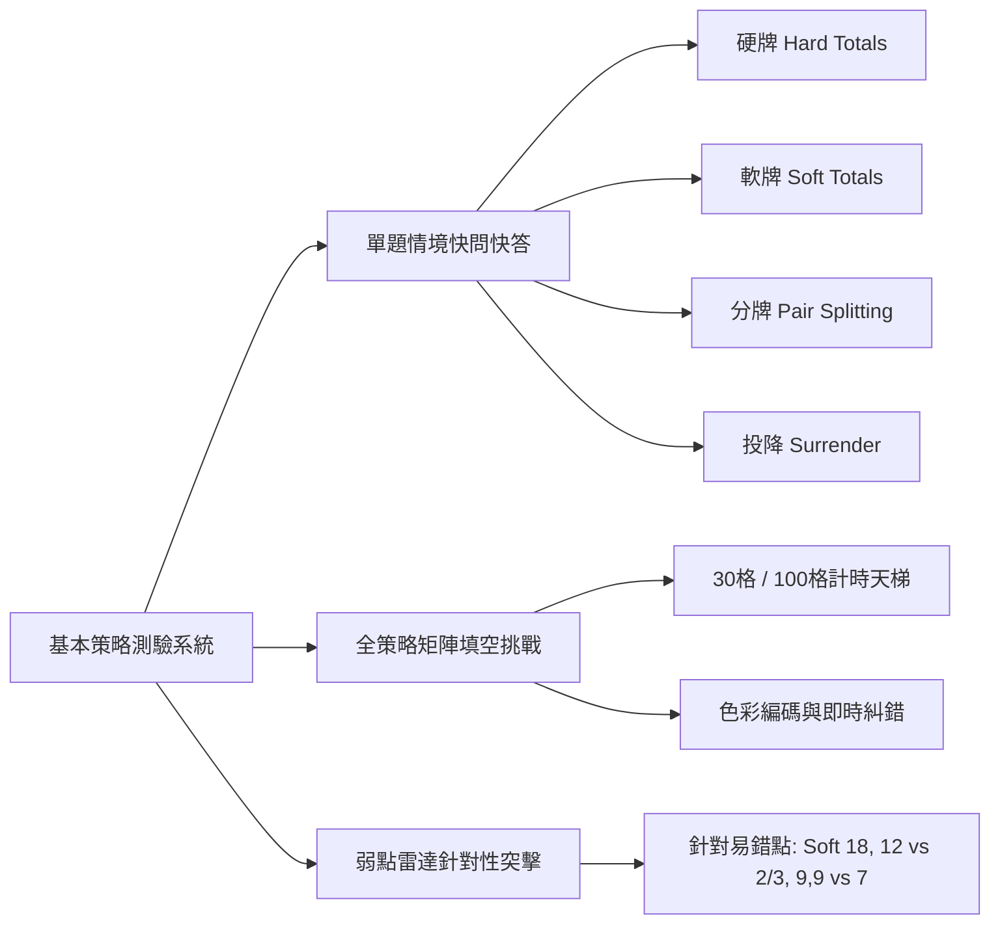

# 產品需求文件 (PRD) - 21點專業學習與算牌訓練平台 (21Master)

**專案名稱**：21Master (Blackjack Pro Learning & Card Counting Simulator)  
**文件版本**：v1.0.0  
**文件狀態**：Approved / Ready for Development  
**目標客群**：21點初學者、進階數學策略愛好者、優勢玩家 (Advantage Players / Card Counters)  

---

## 1. 產品概述與核心目標

### 1.1 產品定位
打造一款**現代化、數據驅動、高沉浸感**的 21 點互動學習與算牌考核 Web 平台。將傳統枯燥的策略表記憶與算牌練習，轉化為具備「即時回饋、即時期望值 (EV) 計算、階梯式測驗與實戰對賭模擬」的專業訓練工具。

### 1.2 核心價值主張
1. **零成本實戰磨練**：逼真還原賭場發牌速度、籌碼堆疊與多玩家檯面干擾。
2. **科學化策略記憶**：告別死背，透過「成對相消」、「弱點針對」、「矩陣填空」建立肌肉記憶。
3. **優勢玩家 (AP) 全套訓練**：從 Hi-Lo 跑數 (RC) 到真數 (TC) 估算，再到 Illustrious 18 偏差決策，一站式養成。

---

## 2. 使用者角色與旅程地圖 (User Persona & Journey)

```mermaid
journey
    title 21Master 學習進階旅程
    section Level 1: 策略新手 (Novice)
      學習基本規則與賭場優勢: 5: Novice
      基本策略閃卡快問快答: 4: Novice
      基本策略矩陣填空達 95% 準確率: 4: Novice
    section Level 2: 算牌學徒 (Apprentice)
      學習 Hi-Lo 標籤與成對相消: 4: Apprentice
      單副牌 20 秒倒數計時挑戰: 3: Apprentice
      牌靴厚度目測與 True Count 折算: 4: Apprentice
    section Level 3: 優勢玩家 (Pro / Advantage Player)
      Illustrious 18 策略偏差實戰: 5: Pro
      模擬賭桌多座位混戰 (HUD 開啟訓練): 5: Pro
      全真實戰模擬 (HUD 關閉，盲算考核): 5: Pro
```

---

## 3. 功能模組詳細規格

### 模組 A：模擬 21 點檯面對賭 (Interactive Table Simulator)

提供高度客製化規則的賭場擬真環境，支援單人多門下注、多位 AI 虛擬玩家干擾，以及專業的教練輔助系統。



#### A1. 賭規自訂引擎 (Rules Engine)
- **牌靴副數**：1副、2副、4副、6副（預設）、8副。
- **莊家規則**：S17（軟17停牌） / H17（軟17要牌）。
- **進階規則切換**：
  - 允許分牌後加倍 (DAS: On/Off)
  - 投降規則 (Late Surrender / None)
  - 分 Ace (Resplit Aces / Hit Split Aces)
  - 黑傑克賠率 (3:2 / 6:5，預設強制 3:2，切換至 6:5 時顯示警語)
- **切牌深度 (Penetration)**：可滑動設定 50% ~ 85%，達到切牌卡 (Cut Card) 時觸發洗牌動畫。

#### A2. 檯面視覺與一體化操作佈局
- **全桌上直覺佈局 (Tabletop Integrated Layout)**：
  - 將「籌碼餘額 (Bankroll)」、「當前下注 (Current Bet)」、「牌靴剩餘」、「籌碼選單 (5/25/100/500)」、「快捷下注 (Clear / 2x / Rebet)」、「發牌 (Deal)」以及「要牌/停牌/加倍/分牌/投降」等所有控制面板**全面內建於綠氈賭桌之中**，讓玩家視線高度聚焦，一目了然。
  - 支援中央下注圈 (Betting Spot) 視覺堆疊籌碼與發牌按鈕金色脈衝呼吸燈。

#### A3. 即時教練與 EV 診斷 (Coach Mode & EV Advisor)
- **教練模式開關強烈對比 (Coach Mode: ON vs OFF)**：
  - **開啟教練模式 (ON)**：
    1. 牌桌中央常駐顯示「🛡️ 即時最優指引告示牌 (Live Coach Banner)」，實時顯示最佳動作（例如：`【要牌 (Hit)】` 或 `【加倍 (Double)】`）與數理決策依據（基本策略 / I18 偏差）。
    2. 下方操作按鈕中，**最優推薦動作按鈕直接附加金色呼吸光暈 (Glow Pulse) 與『★ 推薦』徽章**，直觀引導最佳解。
    3. 玩家若做出次優決策，即時彈出紅色警報並精確指出 EV 損失。
  - **關閉教練模式 (OFF - 實戰盲測考驗)**：
    1. 牌桌中央指示牌反灰並顯示「已關閉 (實戰盲測模式)」。
    2. 隱藏所有按鈕推薦光暈與標籤，100% 模擬真實賭場實戰，只在每局結算後於後台統計準確率。

---

### 模組 B：記憶考核 21 點算牌方式測驗 (Card Counting Trainer)

專為算牌技巧打造的分級訓練營，分為 4 種科學化測驗模式：

#### B1. 模式 1：閃卡速度訓練 (Flashcard Speed Drill)
- **機制**：
  - 單張模式：螢幕中央快速隨機翻牌，玩家需在設定時間（0.2s ~ 1.5s）內按下鍵盤 `+1`、`0`、`-1`。
  - 成對相消模式 (Pair Cancellation)：每次同時翻出 2 張牌（例如 `K` + `4` = 0；`2` + `5` = +2），鍛鍊雙眼掃瞄瞬間抵銷的能力。
- **目標**：測試 50 張牌，統計平均反應秒數（Reaction Time）與準確率。

#### B2. 模式 2：整副牌/牌靴倒數挑戰 (Shoe Countdown Challenge)
- **機制**：
  - 系統載入 1 副牌 (52張) 或 自訂副數。
  - 隨機抽走 1~3 張牌暗蓋在旁。
  - 以設定速度自動（或手動點擊）依序翻開所有剩餘牌。
  - 翻完後，系統要求玩家輸入**最終 Running Count** 以及 **被抽走暗牌的總點數**。
- **考核標準**：
  - 頂尖 AP 等級：52 張牌於 15 秒內完成且 Running Count 100% 正確。

#### B3. 模式 3：牌靴厚度與真數折算測驗 (Deck Estimation & True Count Drill)
- **機制**：
  - 畫面隨機給出一個「當前 Running Count（例如 +7）」與一張「牌靴剩餘厚度視覺圖（例如剩 2.5 副牌）」。
  - 玩家需輸入折算出的 **True Count（四捨五入或向下取整）**。
  - 鍛鍊玩家在賭場桌上目測棄牌盒（Discard Tray）的空間估算能力。

#### B4. 模式 4：Illustrious 18 高階偏差測驗 (Deviation Index Drill)
- **機制**：
  - 隨機出題：「*你的手牌 16，莊家 10，當前 TC 為 +1，你該怎麼做？*」
  - 選項：`Hit`, `Stand`, `Surrender`, `Double`。
  - 判定：基本策略原本為 Hit/Surrender，但在 TC $\ge 0$ 時應 Stand。回答正確給予詳細數學推演解析。

---

### 模組 C：各種基本策略測驗 (Basic Strategy Mastery)

徹底消除玩家在實戰中的猶豫與直覺誤判。



#### C1. 模式 1：情境快問快答 (Flash Decision Drill)
- **題庫分類**：
  1. 硬牌專項 (Hard Totals Drill)
  2. 軟牌專項 (Soft Totals Drill)
  3. 分牌專項 (Pair Splitting Drill)
  4. 投降決策專項 (Late Surrender Drill)
- **作答方式**：單手快捷鍵，畫面呈現玩家手牌與莊家明牌，限時 3 秒作答，連擊累積 Combo 分數。

#### C2. 模式 2：全策略矩陣填空挑戰 (Matrix Grid Challenge)
- **互動介面**：呈現完整的 $X$ 軸（莊家 2~A）與 $Y$ 軸（玩家手牌 8~17+, A2~A9, 22~AA）空白方格。
- **挑戰機制**：
  - 玩家可在矩陣中快速填入代碼 (`H`, `S`, `D`, `P`, `Rh`)。
  - 具備「100格計時天梯模式」，支援即時標色（正確顯示翡翠綠，錯誤顯示緋紅並跳出正確解析）。

#### C3. 模式 3：弱點雷達與抗盲點訓練 (Weakness Radar Drill)
- 系統自動記錄使用者在對賭與測驗中「常犯錯的手牌」。
- 專項出題歷史最高失誤題型：
  - *Hard 12 vs 莊家 2 或 3 (為什麼要 Hit?)*
  - *Soft 18 (A,7) vs 莊家 9, 10, A (為什麼要 Hit 而不能 Stand?)*
  - *Pair 9,9 vs 莊家 7 (為什麼要 Stand 而不是 Split?)*
  - *Pair 4,4 vs 莊家 5, 6 (DAS 與 NDAS 的決策差異)*

---

## 4. 數據統計與遊戲化成就系統 (Analytics & Gamification)

### 4.1 核心指標儀表板 (User Stats Dashboard)
- **策略準確率 (Strategy Accuracy %)**：統計硬牌、軟牌、分牌、投降各維度準確率。
- **平均決策反應時間 (Avg Decision Latency)**：毫秒級反應速度趨勢圖。
- **算牌偏差值 (Counting Variance)**：整副牌測驗中的 RC/TC 誤差率。
- **累計理論 EV 保持率 (EV Preservation Rate)**：因決策失誤損失的理論金額。

### 4.2 稱號與成就等級 (Player Progression Ranks)

| 等級稱號 | 晉升條件 |
| :--- | :--- |
| **Lv 1. 賭場綠角 (Casino Tourist)** | 註冊並完成第一場模擬對賭 (10手牌) |
| **Lv 2. 策略學徒 (Strategy Apprentice)** | 基本策略測驗 100 題準確率達 95% 以上 |
| **Lv 3. 策略大師 (Basic Strategy Master)** | 全策略矩陣填空 100% 正確且在 3 分鐘內完成 |
| **Lv 4. 算牌新星 (Hi-Lo Counter)** | 單副牌跑數測驗 25 秒內完成且答案 100% 正確 |
| **Lv 5. MIT 傳奇玩家 (MIT Team Leader)** | 通過 Illustrious 18 考核 + 盲算模擬對賭 100 手無失誤 |

---

## 5. UI/UX 設計與視覺美學規範

- **設計風格**：**高奢科技暗黑賭場風 (Modern Dark Luxury & Glassmorphism)**。
- **色彩系統 (Color Palette)**：
  - **背景基底**：深海軍藍黑 (`#0B0F19`) 與 質感暗炭灰 (`#111827`)。
  - **檯面毛氈綠**：皇家翡翠綠漸層 (`radial-gradient(#064e3b, #022c22)`)。
  - **強調主色**：香檳金 (`#F59E0B` / `#D97706`)、霓虹藍 (`#38BDF8`)。
  - **狀態提示**：成功綠 (`#10B981`)、警示黃 (`#FBBF24`)、危險/失誤紅 (`#EF4444`)。
- **字體 Typography**：
  - 英文與數字：`Outfit`, `Inter`, `JetBrains Mono`（等寬數字，計時與計數不抖動）。
  - 中文：`Noto Sans TC`, `PingFang TC`。
- **微動效 (Micro-interactions)**：
  - 卡牌翻轉與 3D 透視發牌軌跡 (`transform: perspective(...) rotateY(...)`)。
  - 籌碼點擊水波紋效果與立體陰影。
  - 答對時的翡翠綠光暈脈衝與 Combo 浮空文字。

---

## 6. 技術架構與技術選型建議

### 6.1 前端核心技術
- **架構模式**：
  - 輕量模組化架構（Vanilla ES6+ Modules + Modern CSS Variables）或 Modern Single Page App (Vite + React / Vue 3)。
  - 純客戶端無延遲響應：所有洗牌、算牌、EV 計算均在 Client-side 毫秒級完成，保證離線亦可流暢運行。
- **狀態機架構 (State Machine)**：
  - `GameEngine`：管理牌靴、玩家手牌、莊家手牌、當前動作階段（Betting $\rightarrow$ Dealing $\rightarrow$ PlayerTurn $\rightarrow$ DealerTurn $\rightarrow$ Payout $\rightarrow$ Reshuffle）。
  - `CountingEngine`：即時維護多種算牌法（Hi-Lo, KO, Omega II）的 RC 與 TC 數值。
  - `StrategyEngine`：注入完整的 S17/H17、DAS、投降策略矩陣與 I18 決策樹，支援 `getBestAction(playerHand, dealerUpcard, rules, tc)`。

### 6.2 模組目錄規劃範例
```text
/src
  ├── /engine
  │    ├── Deck.js            # 牌靴、洗牌、切牌深度
  │    ├── Card.js            # 撲克牌點數與算牌標籤映射
  │    ├── Hand.js            # 手牌點數計算 (含 Soft/Hard 判定)
  │    ├── StrategyEngine.js  # 基本策略查詢與期望值矩陣
  │    ├── CountingEngine.js  # Hi-Lo / KO / Omega II 算牌計算機
  │    └── GameEngine.js      # 對賭流程狀態機
  ├── /components
  │    ├── TableView.js       # 21點擬真檯面
  │    ├── CardElement.js     # 帶有翻牌動效的撲克牌元件
  │    ├── CoachHUD.js        # 算牌與教練即時面板
  │    ├── StrategyQuiz.js    # 基本策略單題/矩陣測驗
  │    └── CountingDrill.js   # 閃卡/倒數/牌靴厚度測驗
  ├── /audio
  │    └── SoundManager.js    # 發牌、籌碼、勝負音效合成/播放
  ├── /styles
  │    ├── tokens.css         # 色彩、漸層、陰影、字體定義
  │    ├── table.css          # 擬真檯面與牌靴樣式
  │    └── quiz.css           # 測驗模式專用現代排版
  └── index.html              # 主入口導覽 (Tab 切換：對賭、算牌考核、策略測驗)
```

---

## 7. 驗收標準 (Acceptance Criteria)

1. **基本策略精準度**：策略引擎比對 Stanford Wong 與 Wizard of Odds 權威數據，涵蓋 Hard, Soft, Pairs, Surrender，正確率 100%。
2. **算牌邏輯精準度**：Hi-Lo RC 與 TC（含半副牌精度折算）與 Illustrious 18 偏差切換判定 100% 精確。
3. **測驗功能完整性**：
   - 包含單題閃卡、整副牌倒數、牌靴厚度折算、矩陣填空、弱點針對模式。
   - 所有測驗具備即時評分、秒數計時與錯題解析。
4. **互動體驗與流暢度**：
   - 支援全鍵盤快捷鍵操作，桌面與平板響應式介面無破版。
   - 動畫流暢度達 60fps，無操作阻塞感。
